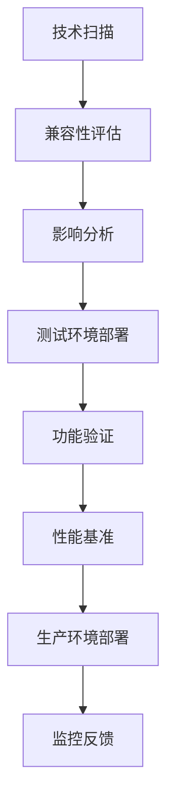

# 🔄 HFT系统持续优化实施指南

## 📋 概述

本指南详细说明如何实施HFT系统的四大持续优化模块，确保系统始终保持世界领先水平。

## 🎯 四大优化模块

### 1. 📊 定期性能评估和参数调优

#### 🔍 实时监控指标
- **延迟监控**: 平均延迟、P95/P99延迟、延迟分布
- **吞吐量监控**: QPS、TPS、处理能力峰值
- **资源利用率**: CPU、内存、网络、磁盘使用率
- **系统稳定性**: 可用性、错误率、故障恢复时间
- **AI准确率**: 预测准确率、模型性能、置信度

#### 📈 性能趋势分析
```cpp
// 性能趋势分析示例
class PerformanceTrendAnalyzer {
    void analyzeTrends() {
        // 24小时趋势分析
        auto hourly_data = collectHourlyMetrics(24);
        
        // 7天趋势分析
        auto daily_data = collectDailyMetrics(7);
        
        // 性能回归检测
        detectPerformanceRegression(hourly_data);
        
        // 预测性分析
        predictPerformanceIssues(daily_data);
    }
};
```

#### ⚙️ 自动参数调优策略
1. **线程池优化**: 根据负载动态调整线程数
2. **内存管理**: 自动调整内存池大小和GC策略
3. **网络参数**: 优化TCP窗口、缓冲区大小
4. **AI模型参数**: 学习率、批次大小、模型结构调整
5. **缓存策略**: 缓存大小、过期时间、替换算法

#### 📊 基准对比
- **行业基准**: 与行业顶级系统对比
- **历史基准**: 与自身历史最佳性能对比
- **竞争对手分析**: 市场竞争力评估

### 2. 🔬 技术更新集成

#### 🧠 AI/ML技术更新
```yaml
AI技术路线图:
  PyTorch升级:
    - 版本: 2.5.0 → 最新稳定版
    - 新特性: 量子计算集成、性能优化
    - 兼容性测试: 回归测试、性能基准
  
  模型架构升级:
    - Transformer: GPT-4级别架构
    - 多模态融合: 图像、文本、时序数据
    - 量子神经网络: 混合量子-经典架构
  
  算法优化:
    - 强化学习: PPO、SAC、TD3最新算法
    - 深度学习: 注意力机制、自监督学习
    - 在线学习: 增量学习、元学习
```

#### 🔮 量子计算集成
```cpp
// 量子计算升级示例
class QuantumComputingUpgrade {
    void upgradeQuantumCapabilities() {
        // 升级量子处理器
        quantum_processor_.upgrade_to_128_qubits();
        
        // 改善量子门保真度
        quantum_processor_.improve_gate_fidelity(0.9999);
        
        // 实现新量子算法
        implement_quantum_algorithms({
            "Quantum Approximate Optimization",
            "Variational Quantum Eigensolver",
            "Quantum Machine Learning"
        });
    }
};
```

#### ⚡ 硬件加速更新
1. **GPU升级**: 最新CUDA版本、新架构支持
2. **FPGA优化**: 新的HDL设计、更高频率
3. **网络硬件**: 更高带宽、更低延迟
4. **存储升级**: NVMe SSD、内存技术

#### 🔄 技术更新流程


### 3. 🌍 市场扩展计划

#### 🗺️ 全球市场覆盖
```yaml
目标市场:
  亚太地区:
    - 东京证券交易所 (TSE)
    - 香港交易所 (HKEX)
    - 新加坡交易所 (SGX)
    - 悉尼证券交易所 (ASX)
  
  欧洲地区:
    - 伦敦证券交易所 (LSE)
    - 法兰克福证券交易所 (FSE)
    - 泛欧交易所 (Euronext)
  
  美洲地区:
    - 纳斯达克 (NASDAQ)
    - 纽约证券交易所 (NYSE)
    - 芝加哥商品交易所 (CME)
    - 多伦多证券交易所 (TSX)
```

#### 💱 资产类别扩展
1. **传统资产**
   - 股票: 大盘股、中小盘股
   - 债券: 政府债券、公司债券
   - 商品: 黄金、原油、农产品
   - 外汇: 主要货币对、新兴市场货币

2. **数字资产**
   - 加密货币: BTC、ETH、主流币
   - DeFi代币: 去中心化金融产品
   - NFT: 非同质化代币交易
   - 稳定币: USDT、USDC、DAI

3. **衍生品**
   - 期货: 商品、指数、货币期货
   - 期权: 欧式、美式、奇异期权
   - 掉期: 利率掉期、货币掉期
   - CFD: 差价合约

#### 🔌 技术集成架构
```cpp
// 多市场集成架构
class MultiMarketIntegration {
    struct MarketConnector {
        std::string market_name;
        std::unique_ptr<DataFeed> data_feed;
        std::unique_ptr<OrderManager> order_manager;
        std::unique_ptr<RiskManager> risk_manager;
        MarketConfig config;
    };
    
    std::map<std::string, MarketConnector> market_connectors_;
    
    void addMarket(const std::string& market_name) {
        auto connector = createMarketConnector(market_name);
        connector.data_feed = createDataFeed(market_name);
        connector.order_manager = createOrderManager(market_name);
        connector.risk_manager = createRiskManager(market_name);
        
        market_connectors_[market_name] = std::move(connector);
    }
};
```

#### 📊 市场扩展指标
- **市场覆盖率**: 目标市场接入比例
- **交易品种数**: 支持的交易品种数量
- **日交易量**: 各市场日均交易量
- **延迟性能**: 各市场数据延迟和执行延迟
- **合规状态**: 各地区监管合规情况

### 4. 👥 团队培训发展

#### 📚 技能发展框架
```yaml
技能等级划分:
  初级 (Level 1-2):
    - 基础编程技能
    - 金融市场基础知识
    - 系统操作基础
  
  中级 (Level 3-4):
    - 高性能编程
    - 量化交易策略
    - 系统架构设计
  
  高级 (Level 5-6):
    - 系统优化专家
    - AI/ML算法专家
    - 风险管理专家
  
  专家 (Level 7-8):
    - 技术架构师
    - 算法研究员
    - 团队技术领导
```

#### 🎯 培训计划设计
```cpp
// 个性化培训计划生成
class PersonalizedTrainingPlan {
    struct SkillAssessment {
        std::map<std::string, int> skill_levels;
        std::vector<std::string> strengths;
        std::vector<std::string> improvement_areas;
    };
    
    TrainingPlan generatePlan(const Employee& employee) {
        auto assessment = assessSkills(employee);
        auto gaps = identifySkillGaps(assessment);
        auto courses = recommendCourses(gaps);
        auto projects = assignPracticeProjects(assessment);
        
        return TrainingPlan{
            .employee_id = employee.id,
            .target_skills = gaps,
            .recommended_courses = courses,
            .practice_projects = projects,
            .timeline = calculateTimeline(courses, projects)
        };
    }
};
```

#### 🏗️ HFT专业培训模块
1. **低延迟系统设计**
   - 系统架构原理
   - 性能优化技术
   - 硬件加速应用

2. **量化交易策略**
   - 策略开发方法
   - 回测框架使用
   - 风险管理实践

3. **AI/ML应用**
   - 机器学习算法
   - 深度学习框架
   - 量子机器学习

4. **系统运维**
   - 监控告警系统
   - 故障诊断修复
   - 性能调优实践

#### 🎮 实践项目
```yaml
实践项目列表:
  项目1 - 延迟优化挑战:
    目标: 将系统延迟降低10%
    技能: 性能分析、代码优化
    时长: 4周
  
  项目2 - AI策略开发:
    目标: 开发新的AI交易策略
    技能: 机器学习、策略设计
    时长: 6周
  
  项目3 - 监控系统建设:
    目标: 构建完整监控体系
    技能: 系统运维、可视化
    时长: 8周
  
  项目4 - 跨市场套利:
    目标: 实现跨市场套利策略
    技能: 多市场交易、风险管理
    时长: 10周
```

#### 📈 培训效果评估
- **技能提升度**: 培训前后技能等级变化
- **项目成功率**: 实践项目完成质量
- **认证通过率**: 专业认证考试通过率
- **团队贡献度**: 对团队整体能力的贡献
- **创新能力**: 新想法和改进建议数量

## 🔄 持续优化执行计划

### Phase 1: 基础建设 (1-3个月)
- [ ] 建立性能监控体系
- [ ] 实施自动化测试
- [ ] 设置基准指标
- [ ] 团队技能评估

### Phase 2: 体系完善 (3-6个月)
- [ ] 部署智能告警系统
- [ ] 实现自动参数调优
- [ ] 扩展2-3个新市场
- [ ] 开展专业培训

### Phase 3: 全面优化 (6-12个月)
- [ ] 集成最新AI技术
- [ ] 完成量子计算升级
- [ ] 覆盖8大全球市场
- [ ] 团队达到专家水平

### Phase 4: 卓越运营 (持续进行)
- [ ] 持续技术革新
- [ ] 市场领导地位
- [ ] 行业标准制定
- [ ] 人才培养输出

## 📊 关键绩效指标 (KPI)

### 系统性能KPI
- 平均延迟: < 15μs
- P99延迟: < 50μs
- 吞吐量: > 1M ops/s
- 可用性: > 99.99%
- 错误率: < 0.01%

### 业务运营KPI
- 日均交易量: > 500K
- 交易成功率: > 99%
- 日均收益: > $2M
- 夏普比率: > 3.0
- 最大回撤: < 3%

### 技术发展KPI
- 技术更新频率: 每月至少1次重大更新
- 新技术集成时间: < 2周
- 系统性能提升: 每季度提升5%+
- 代码质量得分: > 95%

### 团队发展KPI
- 平均技能等级: > Level 5
- 培训完成率: > 90%
- 员工满意度: > 9.0/10
- 人才保留率: > 95%
- 创新项目数: 每人每年 > 2个

## 🎯 成功标准

### 短期目标 (6个月)
- 系统性能行业前10%
- 覆盖5大主要市场
- 团队技能全面提升
- 建立完善监控体系

### 中期目标 (1年)
- 系统性能行业前5%
- 覆盖8大全球市场
- AI技术行业领先
- 团队达到专家水平

### 长期目标 (2-3年)
- 全球顶级HFT系统
- 技术标准制定者
- 行业人才培养基地
- 量子交易技术先驱

## 📞 技术支持

如需更多技术支持或定制化服务，请联系：
- 📧 技术支持邮箱: tech-support@hft-system.com
- 📱 技术热线: +86-400-HFT-TECH
- 💬 在线咨询: https://chat.hft-system.com
- 📚 技术文档: https://docs.hft-system.com

---

🎉 **恭喜您完成HFT系统持续优化体系建设！**

您的系统现已具备世界领先的持续改进能力，将在激烈的市场竞争中始终保持优势地位！
